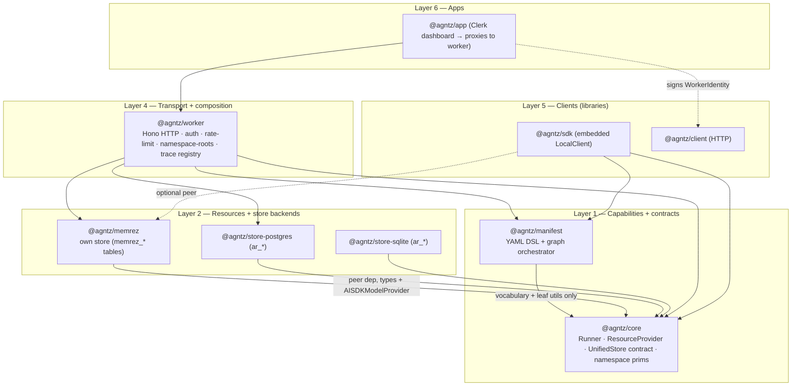
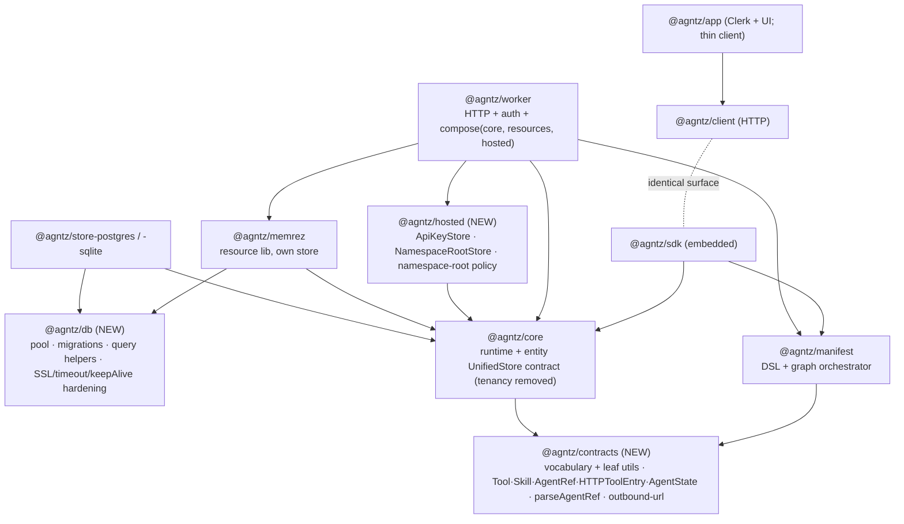

# Library vs. Application Separation

**Status:** in progress — Moves 1 & 2 landed (see Implementation status)
**Date:** 2026-06-15
**Scope:** how to draw clean boundaries between `@agntz/core`, `@agntz/manifest`, the resource layer (`@agntz/memrez`, future RAG), and the application/worker — across both the TypeScript packages and the Python port.
**First move (decided):** extract a shared `@agntz/db` plumbing layer, after the in-flight memory/session delete work lands.

## Implementation status (2026-06-15)

- **Move 1 — `@agntz/db` (TS): ✅ landed.** New package with `@agntz/db/postgres` + `@agntz/db/sqlite` subpaths (drivers as optional peer deps). All four stores (`store-postgres`, `store-sqlite`, `memrez/postgres`, `memrez/sqlite`) migrated onto it. Verified: typecheck + lint green; store-sqlite 95/95, memrez 42/42 and store-postgres 48/48 against a real local Postgres; `@agntz/db` unit tests cover the migrator's reset-on-failure. Full library build + bundle externalization confirmed. **Python `agntz._db` mirror landed** — shared driver loaders (`load_psycopg`/`load_jsonb`) + connection factories (`connect_postgres`/`connect_sqlite`) dedup the lazy-import + connect plumbing across all four Python store classes (basedpyright + pytest green). It's intentionally thinner than TS: Python stores use a single connection (no pool) and run sync idempotent migrations in `__init__`, so there's no pool or migration-promise poison to share. Per-query single-retry on connection-terminated NOT yet done (the TS migration **reset-on-failure** poison fix + keepAlive/timeouts/max + idle-error handler are in).
- **Move 2 — `@agntz/contracts` (TS): ✅ landed.** Zero-runtime-dep kernel holding the full shared vocabulary: outbound-URL policy, agent-ref parser, base errors (`AgntzError`/`InvalidAgentRefError`), the HTTP-tool/auth/skill config (`HTTPToolEntry`/`AgentState`/`ToolReference`/`SkillDefinition`/`HTTPAuth` + variants), and a structural `ExecutionSpanEmitter`. **Finding H is fully resolved** — core's hand-copied structural mirrors are deleted and both core and manifest import the canonical shapes. The `TokenExchangeAuth.apply` drift was resolved to **optional** (the token-resolver already defaults a missing `apply`, and manifest's own validator only checked subfields when present — so it's behavior-preserving on both sides). `parseAgentRef` moved too (the `AgntzError` base went to the kernel as shared error vocabulary; core re-exports it). `SpanEmitter` stays a core class; manifest types against the structural `ExecutionSpanEmitter` instead. **Net: `@agntz/manifest` no longer depends on `@agntz/core` at all** (contracts-only) — the diamond is closed. Verified: full workspace typecheck + test green (contracts 15/15, core 465/465, manifest 213/213, sdk 29/29, worker 117/117); bundles confirm manifest imports contracts and never core. **Python `agntz.contracts` mirror is N/A** — Python's layering is reversed (`core → manifest`; manifest imports nothing from core), so `agntz.manifest` already *is* the shared-vocabulary base. There are no structural mirrors, no `HTTPToolEntry`/`HTTPAuth`/`ToolReference`/`SkillDefinition` types, and no outbound-URL module, so finding H simply doesn't exist in Python — a contracts module would be cosmetic. (Decided 2026-06-15.)

Related decisions (captured previously): the **agntz ↔ memrez interface model** (three layers, two scoping axes, two-primitive delete), the deferred ancestor-semantics removal, and the namespace-roots cross-tenant bounding work.

---

## 1. The mental model: one rule

The question "what goes in the library vs. the application" resolves to a single test:

> **A library knows _what_ (capabilities + contracts). An application knows _who_ and _how_ (identity, transport, hosting policy).**

- **Libraries** expose capabilities and the contracts to plug them together. They never decide who is allowed to call them or how the call arrived.
- **Applications** own HTTP, authentication, multi-tenant policy, rate limiting, super-admin, and Clerk — the "who/how."
- The **SDK is a library** that wires libraries together for *embedded* use (no transport, no identity).
- The **client is a library** that speaks the application's HTTP protocol.

Almost every misplacement in §3 falls out of applying this test.

### The two scoping axes (already decided — do not unify)

| Axis | Key | Owns | Lives in |
|------|-----|------|----------|
| **Tenant** | `userId` / `(userId, sessionId)` | sessions, runs, logs, spans, traces | core store, `store.forUser(userId)` |
| **Namespace** | grant prefix strings (`gymtext/user/123`) | memory entries (+ future RAG) | memrez |

A customer = one agntz **tenant**; its end-users are **namespaces** within that tenant.

---

## 2. Current layering (verified against code)

**What is already correct and worth protecting:**

- `core` does **not** import `memrez` (grep-confirmed). The dependency arrow points the right way: resources depend on core, never the reverse.
- Data ownership is cleanly split — core stores own `ar_*` tables; memrez owns `memrez_*` tables. memrez owning its own store is *by design* and correct.
- The app is a **pure worker proxy** for execution; it never invokes a local Runner.
- The two scoping axes are kept distinct.

### `@agntz/manifest` ↔ `@agntz/core`: siblings, not a stack

manifest is **not** layered on core's runtime — it's a *sibling* that shares core's vocabulary. It walks the agent graph (`llm`/`tool`/`sequential`/`parallel`) and delegates the actual work through an `ExecutionContext` interface (`packages/manifest/src/types.ts:438`); the **bridge** (`packages/sdk/src/bridge.ts`, plus the worker's own copy) implements that interface in terms of core's `Runner`. So consumers form a **diamond**, not a chain: `sdk → manifest → core` *and* `sdk → core` directly — because the join is environment-specific (which store, providers, auth) and must live in the consumer, not in manifest.

The only thing manifest pulls from core is **vocabulary + pure leaf utilities**, never the runtime: types `SkillDefinition`/`ToolReference`/`OutboundUrlPolicyOptions`, and functions `parseAgentRef`/`validateOutboundUrl`/`fetchWithOutboundPolicy`. See finding **H** for the duplication this creates and the `@agntz/contracts` fix.

### Python mirrors this, but flatter

The Python `agntz` package collapses the package boundaries TS makes explicit:

- `memrez*.py` lives at the **top level** of the `agntz` package (not a subpackage) and is re-exported from `__init__.py` alongside core — nothing forces the "resource is a separable layer" boundary.
- `server.py` is a thin FastAPI facade, not the opinionated worker — so Python's "sdk" and "worker" are barely differentiated.
- Store plumbing is duplicated across four classes (`stores/postgres.py`, `stores/sqlite.py`, `memrez_postgres.py`, `memrez_sqlite.py`) with no shared base.

---

## 3. Overlaps, ranked by how much they hurt

### A. Hosted-only concerns are baked into the core library contract (biggest smell)

`ApiKeyStore` and `NamespaceRootStore` are members of core's `UnifiedStore`:

- `packages/core/src/types.ts:1555` — `ApiKeyStore`
- `packages/core/src/types.ts:1575` — `NamespaceRootStore`

These are pure "who/how" — authentication + multi-tenant policy — yet every backend must implement them, including the embedded SDK's sqlite and the Python sqlite store, which authenticate nobody. Core's Runner is tenant-agnostic; only its *store contract* drags tenancy in.

### B. DB plumbing duplicated 4× (and 4× again in Python), no shared base

Each of `store-postgres`, `store-sqlite`, `memrez/postgres.ts`, `memrez/sqlite.ts` independently re-implements pool creation, pragma/SSL setup, the migration runner, the version table, and query helpers. This is **not** domain overlap (table ownership is clean) — it is plumbing copy-paste.

**This is where the production outage lived.** The poisoned `migratePromise` (cached-forever on failure) plus missing SSL/timeout/keepAlive config is a per-store bug that currently must be fixed in four places. A shared layer fixes the class once.

### C. The app carries a dead local Runner + UnifiedStore

`requireUserContext()` constructs a core Runner and a store, but nothing invokes them — execution proxies to the worker over a signed HMAC `WorkerIdentity`. The dead store even re-implements pool init with a *different* (Vercel/Railway) config — a second copy of the B bug class, on code that never runs.

### D. SDK ↔ client surface parity has flipped (surface issue, not layering)

The earlier gap ("client lacks memory admin") is **closed** — `@agntz/client` now exposes the full `memory.*` surface (`import, scan, read, list, deleteEntry, correct, curate, deleteScope`), backed by namespace-root-bounded `workerAuth` routes. The asymmetry is now reversed: the **SDK lags**.

| Capability | `@agntz/client` (HTTP) | `@agntz/sdk` (embedded) |
|------------|:---:|:---:|
| `agents.{list,get,import}` | ✅ | ❌ |
| `sessions.import` | ✅ | ❌ |
| `runs.{start,stream,cancel}` | ✅ | ❌ |
| `traces.{stream,delete}` | ✅ | ❌ |
| `memory.import` | ✅ | ❌ |
| `memory.curate` | ✅ | ⚠ signature differs |
| `memory.{scan,read,list,deleteEntry,deleteScope,correct}` | ✅ | ✅ |

Goal remains a one-line import swap between embedded and hosted.

### E. Python collapses the library/application boundary

See §2. The TS package split is an asset — it enforces the boundary for free. Python relies on convention and currently provides none.

### F. memrez → core coupling is marginally wider than "namespace primitives only" (minor)

`packages/memrez/src/llm-reasoner.ts:1` imports the concrete `AISDKModelProvider` *value* (not just a type) from core. The `peerDependency` declaration (`@agntz/core >= 1.5.0`) is the correct call for a plugin. If maximal decoupling is wanted, inject a `ModelProvider` interface instead of constructing the concrete provider inside memrez.

### G. Namespace ancestor semantics still present (decided, deferred)

`visibleScopes` ancestor expansion + `WritePolicy.ancestorPromotion` keep scopes non-opaque. They are also a live cross-tenant hazard (ancestor expansion must be disabled on every scope-ingesting path when bounding to tenant roots). Removing them makes scopes provably flat and `deleteScope` leak-free by construction. Tracked as its own PR.

### H. `core` doubles as the shared-vocabulary package → bidirectional type duplication (low-stakes, clarifying)

manifest depends on core only for *vocabulary + leaf utilities* — never the runtime (see §2). The leak runs **both** ways: because *"core cannot depend on manifest (manifest is the dependant)"* (`packages/core/src/auth/types.ts:5`), core keeps hand-copied **structural mirrors** of manifest's types (`packages/core/src/http-tool.ts:40,57` — `HTTPToolEntry`, `AgentState`). The same shapes are declared on both sides purely to dodge a dependency. That's the symptom of a missing shared kernel; it's what makes the `core ↔ manifest` "diamond" feel off. Fixed by extracting `@agntz/contracts` (Move 2).

---

## 4. Target shape — a shared kernel + two seams resolve most of it

Introduce a shared **kernel** (`@agntz/contracts`) plus two **seams** (`@agntz/db`, `@agntz/hosted`) so the concerns stop bleeding:

| Layer | Package | Responsibility | Fixes |
|------|---------|----------------|-------|
| 0 · kernel | **`@agntz/contracts`** *(new)* | shared vocabulary (`Tool`/`Skill`/`AgentRef`/`HTTPToolEntry`/`AgentState`) + leaf utils (`parseAgentRef`, outbound-url). Both core and manifest depend on it; kills the structural mirrors. | H |
| 0 · plumbing | **`@agntz/db`** *(new)* | pool, migrations, query helpers, the SSL/timeout/keepAlive + `migratePromise`-reset hardening. Used by **both** core stores and memrez stores. | B + outage class |
| 1 | `@agntz/core` | runtime + entity `UnifiedStore` contract **minus** tenancy | A |
| 1 | `@agntz/manifest` | YAML DSL + graph orchestrator; delegates execution via `ExecutionContext` | — |
| 2 | `@agntz/memrez` | resource lib, own store on `@agntz/db` | — |
| 3 | **`@agntz/hosted`** *(new, or fold into worker)* | `ApiKeyStore`, `NamespaceRootStore`, namespace-root policy. Worker requires `UnifiedStore & HostedStore`; SDK requires only `UnifiedStore`. | A |
| 4 | `@agntz/worker` | HTTP + auth + `compose(core, resources, hosted)` | — |
| 5 | `@agntz/sdk` == `@agntz/client` | identical surfaces | D |
| 6 | `@agntz/app` | Clerk + UI + thin client; no local runtime | C |

---

## 5. Sequenced moves

Independent and value-first. Each is shippable on its own.

### Move 1 — `@agntz/db` plumbing extraction (FIRST, after delete work)

- [x] Create `@agntz/db` exposing: a pool/connection factory (postgres + sqlite), a migration runner + version-table helper. (Parameterized-query helpers left in the stores for now — the real cross-package duplication was pool + migrations.)
- [x] Bake the outage hardening in **once**: timeout/keepAlive/max config, an error handler on idle clients, and **reset of the migration promise on failure** (no permanent poison). SSL kept as a passthrough (deployment concern). _Per-query single-retry on connection-terminated still TODO._
- [x] Migrate `store-postgres`, `store-sqlite`, `memrez/postgres.ts`, `memrez/sqlite.ts` onto it. Table ownership unchanged (`ar_*` vs `memrez_*`).
- [x] Behavior-preserving; covered by existing store conformance tests (verified against a real local Postgres) + new `@agntz/db` unit tests.
- [x] Mirrored in Python as `agntz._db` — shared driver loaders (`load_psycopg`/`load_jsonb`) + connection factories (`connect_postgres`/`connect_sqlite`) used by all four store classes. Thinner than TS (single connection, no pool; sync idempotent migrations, so no versioned migrator/poison fix to share).

### Move 2 — extract `@agntz/contracts` (shared kernel)

- [x] New **zero-runtime-dep** package `@agntz/contracts`, seeded with the outbound-URL policy: `validateOutboundUrl`, `assertOutboundUrlAllowed`, `fetchWithOutboundPolicy`, `OutboundUrlPolicyOptions`, `OutboundUrlPolicyError`. Name `contracts` over `types` because it ships runtime values, not just type declarations.
- [x] Repoint manifest's outbound-URL imports → `@agntz/contracts`; core re-exports from the original path so its public surface and internal imports are unchanged. Behavior-preserving (verified green).
- [x] **Vocabulary dedup (DONE).** Moved `HTTPToolEntry`/`AgentState`/`ToolReference`/`SkillDefinition` + the declarative auth config (`HTTPAuth` + variants) into the kernel and deleted core's structural mirrors (`http-tool.ts`, `auth/types.ts`) and manifest's originals; both now import the canonical shapes. The `TokenExchangeAuth.apply` drift was resolved to **optional** — behavior-preserving, since the token-resolver already defaults a missing `apply` and manifest's validator only checked subfields when present.
- [x] `parseAgentRef` → kernel, along with the `AgntzError` base + `InvalidAgentRefError` (shared error vocabulary). core re-exports them so its error surface and `instanceof` behavior are unchanged.
- [x] `SpanEmitter` — left as a core class; instead added a structural `ExecutionSpanEmitter` interface in the kernel that core's `SpanEmitter` satisfies, so manifest types against that. Net: **manifest no longer depends on `@agntz/core`** (contracts-only).
- [x] `AgentDefinition` stays in core — manifest never imports it, it *converts to* it via the bridge — so the kernel stays minimal.
- [x] Python `agntz.contracts`: **N/A** (decided). Python's layering is reversed (`core → manifest`); `agntz.manifest` already serves as the shared-vocabulary kernel, and there are no mirrors / HTTP-tool-auth types / outbound-URL module to dedup. A contracts module would be cosmetic.

### Move 3 — drop the app's dead Runner/store

- [ ] Remove the unused local Runner + UnifiedStore from `requireUserContext()`.
- [ ] Make the app an honest thin client (Clerk auth → authz gate → sign identity → proxy).
- [ ] Removes a footgun (divergent store-init) and a copy of the B bug class on never-run code.

### Move 4 — SDK → client surface parity

- [ ] Add to `@agntz/sdk`: `agents.{list,get,import}`, `sessions.import`, `runs.{start,stream,cancel}`, `traces.{stream,delete}`, `memory.import`; align `memory.curate` signature.
- [ ] Mechanical against the local Runner/stores; serves the one-line-import-swap goal.

### Move 5 — hosted-store extraction (`@agntz/hosted`)

- [ ] Define `HostedStore` composing `ApiKeyStore` + `NamespaceRootStore`; remove them from core's `UnifiedStore`.
- [ ] Worker requires `UnifiedStore & HostedStore`; SDK requires only `UnifiedStore`.
- [ ] Largest blast radius (every store impl + worker wiring) — do after the earlier moves de-risk the stores.

### Move 6 — Python module boundaries

- [x] `agntz._db` extracted (Move 1 mirror).
- [ ] Mirror the remaining TS boundaries inside the single distribution where they apply: `agntz.resources.memrez`, `agntz.hosted`; stop top-level-exporting memrez as if it were core. **Note:** `agntz.contracts` is N/A — Python's layering is reversed (`core → manifest`), so `agntz.manifest` is already the shared-vocabulary kernel (no mirrors/diamond to break). `agntz.core` is *not* pure today (it imports manifest's vocabulary + `interpolate`); making it pure would mean factoring shared vocabulary out of manifest, which has no functional payoff in Python.

### Parallel / independent

- [ ] **G** — remove namespace ancestor semantics (own PR; touches manifest schema + memrez + site docs; memrez major bump).
- [ ] **F** — optionally inject `ModelProvider` into memrez's reasoner instead of constructing `AISDKModelProvider` (minor decoupling).
